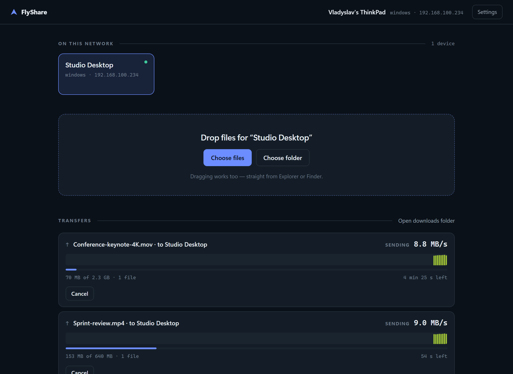

<div align="center">

# FlyShare

**Send files between your devices over Wi-Fi. Fast, encrypted, no cloud.**

[](https://github.com/LunovVladyslav/file-share-app/actions/workflows/ci.yml)
[](https://github.com/LunovVladyslav/file-share-app/releases)
[](LICENSE)


**[flyshare website](https://lunovvladyslav.github.io/file-share-app/)** · [Українською](README.uk.md)



</div>

---

Moving a large file between a Windows laptop and a Mac usually means a USB stick,
a cloud upload you have to wait for twice, or a chat app that quietly compresses
your video. FlyShare skips all of it: both machines find each other on the
network, you compare a six-digit code once, and files go straight from one disk
to the other.

- **Fast** — parallel TCP streams and raw byte framing. 465 MiB/s over loopback, far past what any Wi-Fi link can carry.
- **Encrypted** — TLS 1.3 on every connection, with forward secrecy. There is no unencrypted mode.
- **Nothing to configure** — devices appear by themselves. No accounts, no server, no ports to forward.
- **Zero dependencies** — the entire app is Node's standard library. `npm ls` is empty.

## Download

Grab the file for your system from the [latest release](https://github.com/LunovVladyslav/file-share-app/releases/latest)
and run it. There is no installer and you do not need Node.js.

| System | File |
|---|---|
| Windows 10/11 (x64) | `flyshare-win-x64.exe` |
| macOS (Apple Silicon) | `flyshare-darwin-arm64` |
| macOS (Intel) | `flyshare-darwin-x64` |
| Linux (x64) | `flyshare-linux-x64` |
| Android 8+ | `flyshare-android.apk` |

On macOS and Linux, mark it executable first:

```bash
chmod +x flyshare-darwin-arm64 && ./flyshare-darwin-arm64
```

Or run it from source — Node.js 20 or newer:

```bash
npm start
```

**Android** is not on Google Play, so the APK installs directly: open the
downloaded file and allow installation from that source when asked. The phone
speaks the same protocol as the desktop — the same discovery, the same
six-digit pairing, the same encryption — and appears in the list like any other
device.

## First run

1. Start FlyShare on both devices. Each shows up in the other's list within a few seconds.
2. Click the new device. A six-digit code appears.
3. Check that **the other screen shows the same code**, then confirm there.

That is the whole setup, and it is permanent. From then on you drag files onto
the window, or use **Choose files** / **Choose folder**, and they go.

If the two codes differ, do not confirm — something is sitting between you.

<div align="center">

</div>

## What it looks like

<table>
<tr>
<td width="50%"><br><em>Light or dark, following the system or pinned</em></td>
<td width="50%"><br><em>Transfers as a list or an adaptive grid</em></td>
</tr>
<tr>
<td colspan="2"><br><em>English, German, Ukrainian and Polish; folder picker; stream count; paired devices</em></td>
</tr>
</table>

The coloured strip on an active transfer is a live throughput trace. Bar height
is the rate, and the colour maps to absolute speed on a log scale — so a Wi-Fi
dip and its recovery are visible instead of averaged away.

## Why it is fast

**Parallel TCP streams.** A single connection on Wi-Fi is limited by its
congestion window and stalls on every lost packet. Four connections recover
independently and keep the radio busy. It is the single biggest lever, and it is
exposed in settings.

**Payload never goes through a parser.** Control messages are length-prefixed
JSON, but file bytes are raw: `[4-byte length][JSON header][data]`. Nothing is
base64'd, escaped, or turned into a string.

**Positional writes, no locking.** The receiver reserves each file at full size
up front, so every stream writes at its own offset in parallel without extending
the file.

**Large files are split into 32 MB chunks**, so one 8 GB video still uses every
stream. Small files go one per stream, which spreads a thousand-file folder
across connections naturally.

### What encryption costs

Measured on loopback, one 1.2 GB file, four streams:

| | Throughput |
|---|---|
| Without encryption | 838 MiB/s |
| TLS 1.3 (ChaCha20-Poly1305) | 465 MiB/s |

Encryption takes about 45% off the peak — but 465 MiB/s is 3.7 Gbit/s, twice
what gigabit Ethernet carries and roughly three times real-world Wi-Fi 6.
**On an actual network encryption is free**: the link is always the bottleneck,
never the CPU.

## Security

Every connection is TLS 1.3, keyed by the pairing. The session key mixes a
throwaway key exchange with the long-term secret both devices derived when they
were paired:

```
HKDF( ikm  = X25519(both sides' ephemeral keys)     -> forward secrecy
      salt = X25519(long-term keys pinned at pairing) -> authentication
      info = "flyshare-session-v2" + both device ids )
```

The ephemeral half means recorded traffic stays unreadable even if the key file
is stolen later. The long-term half means an unpaired device cannot derive the
key at all, so its handshake simply fails — there is no unencrypted fallback.

The six-digit code deserves a note. Deriving it straight from the key exchange
would be **broken**, not merely weaker: a machine in the middle picks its own
keys, so it could try key after key until the two codes it displays match —
about a million cheap attempts. FlyShare borrows ZRTP's fix. The responding
device commits to a hash of its key and a nonce *before* it sees the initiator's,
so neither side can still be shopping for a key once it knows the other's. That
puts an attacker back at one chance in a million.

Full threat model, and the limits, in [SECURITY.md](SECURITY.md).

## How it works

```
src/core/discovery.js   finding devices — UDP multicast + broadcast
src/core/identity.js    this device's long-term X25519 key
src/core/pairing.js     six-digit code comparison, key pinning
src/core/trust.js       paired devices and their keys
src/core/secure.js      session keys and the upgrade to TLS
src/core/protocol.js    message framing
src/core/server.js      receiving: consent, preallocation, positional writes
src/core/client.js      sending: chunk queue, parallel streams
src/core/manifest.js    folder walking and path safety
src/ui-server.js        local HTTP + SSE bridge for the interface
ui/                     the interface itself
```

**Discovery.** Every device announces itself to a multicast address *and* the
subnet broadcast every three seconds, because plenty of home routers drop one
but not the other. Announcements carry all local addresses, and the receiver
picks the one sharing a subnet with it, preferring physical interfaces over
virtual ones — otherwise a Windows machine advertises a Hyper-V switch address
that the Mac in the next room cannot reach.

The full wire format — discovery packets, framing, the pairing exchange, key
derivation and the receiver's obligations — is written down in
**[docs/PROTOCOL.md](docs/PROTOCOL.md)**, precisely enough to build a second
implementation from. `npm run test:spec` checks that document against the code.

**Transfer.** One TCP port handles everything; the first plaintext frame says
what the connection is for.

```
sender                                 receiver
   │  session: id + ephemeral key        │
   │ ──────────────────────────────────► │
   │  session-ok: id + ephemeral key     │  (unpaired device is refused here)
   │ ◄────────────────────────────────── │
   │                                     │
   │        ══ everything below is inside TLS 1.3 ══
   │                                     │
   │  offer: file list and sizes         │
   │ ──────────────────────────────────► │  asks the person
   │  offer-result: accepted + token     │  reserves the files on disk
   │ ◄────────────────────────────────── │
   │                                     │
   │  N parallel connections:            │
   │  [chunk header][raw bytes] …        │
   │ ──────────────────────────────────► │  writes at offset
   │  done                               │
   │ ◄────────────────────────────────── │
```

## Settings

| Setting | Default | What it does |
|---|---|---|
| Device name | the computer's name | how others see you |
| Download folder | `~/Downloads/FlyShare` | where incoming files land; pick it or type it |
| Language | follows the browser | English, German, Ukrainian, Polish |
| Appearance | follows the system | light or dark |
| Transfer layout | list | list or adaptive grid |
| Parallel streams | 4 | 8 can help on a stable link |
| Accept without asking | off | applies only to devices you already paired |

State lives in `~/.flyshare/`: `config.json`, `identity.json` (private key, mode
600) and `peers.json` (pinned keys). `FLYSHARE_HOME` moves all of it elsewhere,
which is what makes portable installs and side-by-side instances possible.

Ports can be changed with `FLYSHARE_DISCOVERY_PORT`, `FLYSHARE_TRANSFER_PORT`
and `FLYSHARE_UI_PORT`.

Deleting `identity.json` means pairing every device again — a deliberately
visible failure rather than a silent one.

## Building from source

```bash
npm ci
npm test           # 50 checks across four suites
npm run build      # dist/flyshare-<platform>-<arch>
```

The build turns the ES modules into one CommonJS file with esbuild, folds the
interface in as embedded assets, and injects the result into a copy of the Node
binary using Node's single-executable support. On Windows the Authenticode
signature is stripped first — otherwise the modified binary refuses to start —
and on macOS the result is re-signed ad-hoc.

Screenshots in this README are generated from a running instance, never mocked:

```bash
npm start                                   # in one terminal
npm run screenshots                         # in another
```

### The Android app

```bash
cd android
./gradlew :core:test          # the protocol core, no SDK or emulator needed
./gradlew :app:assembleRelease
```

The protocol core is plain Kotlin with no Android imports, which is what lets
it be tested on a laptop and checked against the Node implementation directly:

```bash
./gradlew :core:receive -PoutDir=/tmp/in     # then, in another terminal:
node spike/send-to.mjs 127.0.0.1 45889 <peerId> <path>
```

`:core:send` and `spike/receive-at.mjs` do the same in the other direction. All
four combinations of the two implementations run on one machine, which is where
a failure can actually be read.

**Signing.** A release APK is signed with a key that is not in this repository
— whoever holds it can publish an update that Android installs over the app.
Create your own once:

```bash
keytool -genkeypair -v -keystore release.jks -alias flyshare -keyalg RSA -keysize 4096 -validity 10000
```

Then put its location and passwords in `android/keystore.properties`, which is
git-ignored:

```properties
storeFile=/absolute/path/to/release.jks
storePassword=…
keyAlias=flyshare
keyPassword=…
```

Without that file the release build still runs and produces an *unsigned* APK
— useful for testing, and impossible to install by accident. CI reads the same
four values from the secrets `ANDROID_KEYSTORE_BASE64`,
`ANDROID_KEYSTORE_PASSWORD`, `ANDROID_KEY_ALIAS` and `ANDROID_KEY_PASSWORD`.

## If the devices cannot see each other

1. Are both devices on **the same network and subnet**? Guest Wi-Fi often has client isolation, which blocks all device-to-device traffic.
2. Does the firewall allow the app on private networks? Windows asks on first run; macOS asks too, and macOS 15+ has a separate Local Network permission under Privacy & Security.
3. Is a VPN active? It can capture the route to the local network.
4. Does the startup banner show your LAN address (`192.168.…`), not just a virtual one?

If a device is visible but connecting fails, one side may have forgotten it.
Pair again.

## Limits

- Symlinks and special files are skipped — they do not survive a Windows ↔ macOS round trip predictably.
- Permissions and timestamps are not carried over.
- An interrupted transfer cannot be resumed; it starts again.
- Protocol v2 is deliberately incompatible with v1, so an old unencrypted client gets a clear refusal rather than a silent downgrade.
- The interface needs a current browser (it uses `light-dark()` and `color-mix()`).
- On Android, a transfer runs while the app is open or in the background, but not after the system stops the process; and Android refuses to hand out the storage root or `Download` itself as a destination, so choosing a folder means picking one inside them.

## License

MIT — see [LICENSE](LICENSE).

Built by [Vladyslav Lunov](https://github.com/LunovVladyslav).
