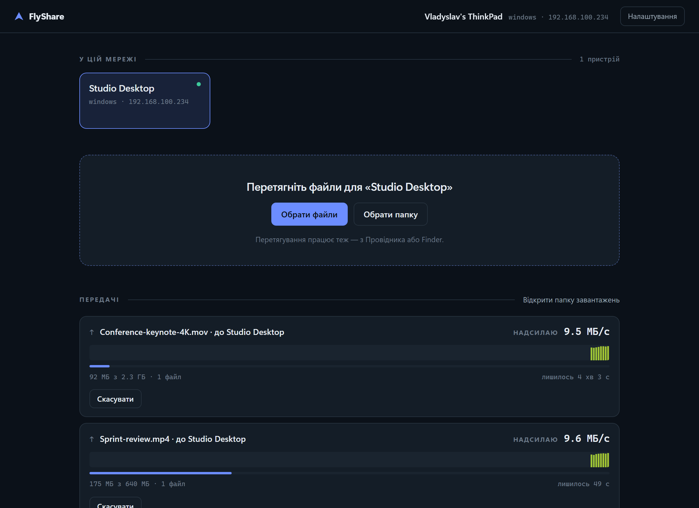
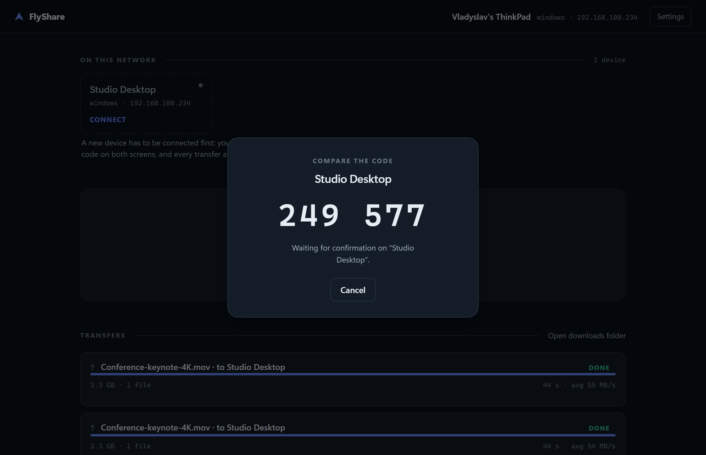
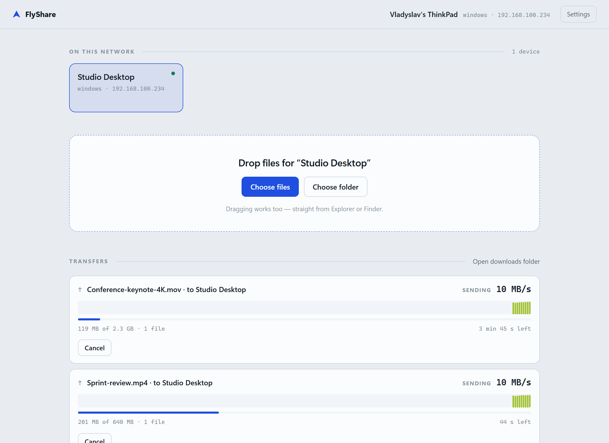
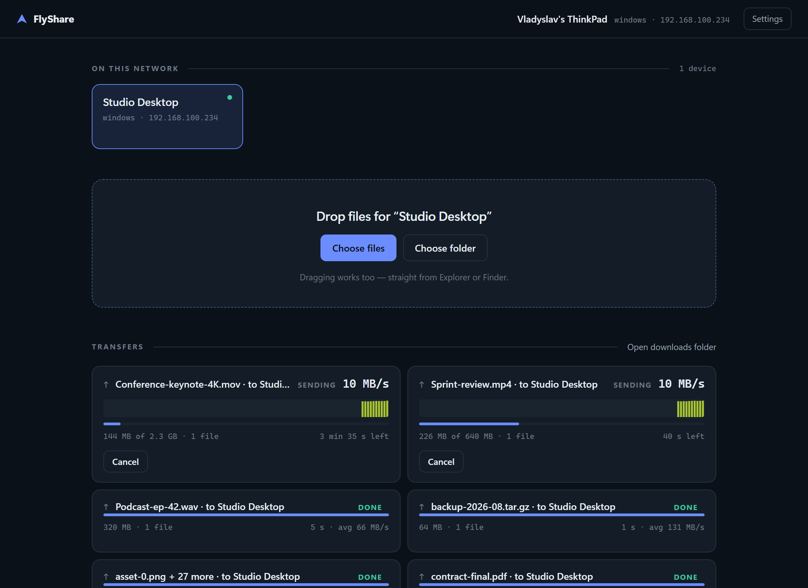
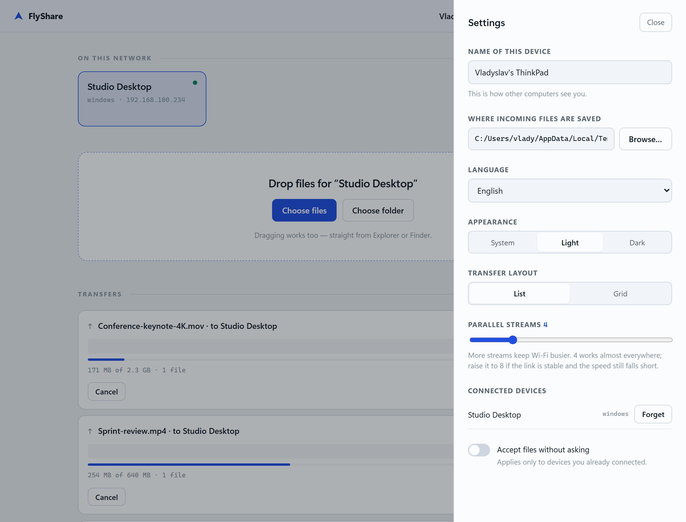

<div align="center">

# FlyShare

**Передача файлів між своїми комп'ютерами по Wi-Fi. Швидко, зашифровано, без хмари.**

[](https://github.com/LunovVladyslav/file-share-app/actions/workflows/ci.yml)
[](https://github.com/LunovVladyslav/file-share-app/releases)
[](LICENSE)


**[сайт проєкту](https://lunovvladyslav.github.io/file-share-app/)** · [In English](README.md)



</div>

---

Перекинути великий файл із ноутбука на Windows на Mac зазвичай означає флешку,
завантаження в хмару, яке треба чекати двічі, або месенджер, що тихо стисне
ваше відео. FlyShare пропускає все це: обидві машини знаходять одна одну в
мережі, ви один раз звіряєте шестизначний код — і файли йдуть напряму з диска
на диск.

- **Швидко** — паралельні TCP-потоки й сирі байти без парсера. 465 МіБ/с на loopback, значно більше за будь-який Wi-Fi.
- **Зашифровано** — TLS 1.3 на кожному з'єднанні, з forward secrecy. Нешифрованого режиму немає.
- **Нічого не налаштовувати** — пристрої з'являються самі. Без акаунтів, без сервера, без прокидання портів.
- **Нуль залежностей** — увесь застосунок це стандартна бібліотека Node. `npm ls` порожній.

## Завантажити

Візьміть файл для своєї системи з [останнього релізу](https://github.com/LunovVladyslav/file-share-app/releases/latest)
і запустіть. Інсталятора немає, Node.js не потрібен.

| Система | Файл |
|---|---|
| Windows 10/11 (x64) | `flyshare-win-x64.exe` |
| macOS (Apple Silicon) | `flyshare-darwin-arm64` |
| macOS (Intel) | `flyshare-darwin-x64` |
| Linux (x64) | `flyshare-linux-x64` |

На macOS і Linux спершу зробіть файл виконуваним:

```bash
chmod +x flyshare-darwin-arm64 && ./flyshare-darwin-arm64
```

Або запустіть із коду — потрібен Node.js 20+:

```bash
npm start
```

## Перший запуск

1. Запустіть FlyShare на обох комп'ютерах. Кожен з'явиться в списку іншого за кілька секунд.
2. Натисніть на новий пристрій. З'явиться шестизначний код.
3. Переконайтеся, що **на другому екрані той самий код**, і підтвердіть там.

Це все налаштування, і воно назавжди. Далі просто перетягуєте файли у вікно
або тиснете **Обрати файли** / **Обрати папку**.

Якщо коди різні — не підтверджуйте. Це означає, що між вами хтось є.

<div align="center">

</div>

## Як це виглядає

<table>
<tr>
<td width="50%"><br><em>Світла або темна, за системою чи вручну</em></td>
<td width="50%"><br><em>Передачі списком або адаптивною сіткою</em></td>
</tr>
<tr>
<td colspan="2"><br><em>Англійська, німецька, українська, польська; вибір папки; кількість потоків; з'єднані пристрої</em></td>
</tr>
</table>

Кольорова смуга в активній передачі — це живий графік швидкості. Висота
стовпчика показує пропускну здатність, а колір кодує абсолютну швидкість за
логарифмічною шкалою, тож просідання Wi-Fi і відновлення видно, а не усереднено.

## Чому це швидко

**Паралельні TCP-потоки.** Одне з'єднання на Wi-Fi обмежене вікном
перевантаження і просідає після кожного втраченого пакета. Чотири з'єднання
відновлюються незалежно й тримають радіо завантаженим. Це найбільший важіль, і
він винесений у налаштування.

**Байти не проходять через парсер.** Керування — це JSON-кадри з префіксом
довжини, але дані файлів ідуть сирими: `[4 байти довжини][JSON-заголовок][дані]`.
Нічого не кодується в base64, не екранується і не стає рядком.

**Позиційний запис без блокувань.** Приймач одразу резервує файл на повний
розмір, тож кожен потік пише у свій зсув паралельно, не подовжуючи файл.

**Великі файли ріжуться на частини по 32 МБ**, тож один 8-гігабайтний відеофайл
теж використовує всі потоки. Дрібні файли йдуть по одному на потік — папка з
тисячею файлів розподіляється між з'єднаннями природно.

### Скільки коштує шифрування

Заміряно на loopback, 1.2 ГБ одним файлом, 4 потоки:

| | Швидкість |
|---|---|
| Без шифрування | 838 МіБ/с |
| TLS 1.3 (ChaCha20-Poly1305) | 465 МіБ/с |

Шифрування забирає близько 45% пікової швидкості — але 465 МіБ/с це 3.7 Гбіт/с,
вдвічі більше за гігабітний Ethernet і втричі більше за реальний Wi-Fi 6.
**На справжній мережі шифрування безкоштовне**: вузьке місце завжди канал, а не
процесор.

## Безпека

Кожне з'єднання — TLS 1.3 з ключем, прив'язаним до спарювання. Сесійний ключ
змішує одноразовий обмін із довгостроковим секретом, який обидва пристрої
вивели під час спарювання:

```
HKDF( ikm  = X25519(одноразові ключі обох сторін)      -> forward secrecy
      salt = X25519(довгострокові ключі зі спарювання) -> автентифікація
      info = "flyshare-session-v2" + обидва id )
```

Одноразова частина означає, що записаний трафік лишається нечитним, навіть якщо
файл із ключами вкрадуть пізніше. Довгострокова означає, що неспарений пристрій
взагалі не виведе цей ключ, тож його рукостискання просто не пройде —
резервного нешифрованого шляху немає.

Про шестизначний код варто сказати окремо. Вивести його прямо з обміну ключами
було б **зламано**, а не просто слабше: машина посередині обирає власні ключі,
тож могла б перебирати їх, доки два коди, які вона показує, не збіжаться —
близько мільйона дешевих спроб. FlyShare бере рішення з ZRTP. Той, хто
відповідає, спершу надсилає геш свого ключа й випадкового числа, і лише потім
бачить ключ ініціатора, тож жодна сторона вже не може підбирати ключ, знаючи
чужий. Це повертає атакувальника до одного шансу на мільйон.

Повна модель загроз і межі — у [SECURITY.md](SECURITY.md).

## Як це влаштовано

```
src/core/discovery.js   пошук пристроїв — UDP multicast + broadcast
src/core/identity.js    довгостроковий ключ X25519 цього пристрою
src/core/pairing.js     звіряння шестизначного коду, закріплення ключів
src/core/trust.js       з'єднані пристрої та їхні ключі
src/core/secure.js      сесійні ключі та перехід у TLS
src/core/protocol.js    кадрування повідомлень
src/core/server.js      приймач: згода, резервування файлів, запис за зсувами
src/core/client.js      відправник: черга частин, паралельні потоки
src/core/manifest.js    обхід папок і безпека шляхів
src/ui-server.js        локальний HTTP + SSE міст для інтерфейсу
ui/                     сам інтерфейс
```

**Пошук пристроїв.** Кожен пристрій кожні 3 секунди розсилає анонс на
multicast-адресу *і* на broadcast підмережі, бо багато домашніх роутерів ріжуть
щось одне. Анонс містить усі локальні адреси, а отримувач обирає ту, що в
спільній підмережі з ним, надаючи перевагу фізичним інтерфейсам над
віртуальними — інакше Windows-машина анонсує адресу Hyper-V, до якої Mac у
сусідній кімнаті не достукається.

Повний формат обміну — пакети виявлення, кадрування, спарювання, виведення
ключів і обов'язки приймача — описаний у **[docs/PROTOCOL.md](docs/PROTOCOL.md)**
достатньо точно, щоб за ним написати другу реалізацію. `npm run test:spec`
звіряє той документ із кодом.

**Передача.** Один TCP-порт обслуговує все; перший відкритий кадр каже, що це.

```
відправник                             приймач
    │  session: id + одноразовий ключ     │
    │ ──────────────────────────────────► │
    │  session-ok: id + одноразовий ключ  │  (неспареному — відмова)
    │ ◄────────────────────────────────── │
    │                                     │
    │        ══ далі все всередині TLS 1.3 ══
    │                                     │
    │  offer: список файлів, розміри      │
    │ ──────────────────────────────────► │  показує запит користувачу
    │  offer-result: згода + токен        │  резервує файли на диску
    │ ◄────────────────────────────────── │
    │                                     │
    │  N паралельних з'єднань:            │
    │  [chunk-заголовок][сирі байти] …    │
    │ ──────────────────────────────────► │  запис за зсувом
    │  done                               │
    │ ◄────────────────────────────────── │
```

## Налаштування

| Параметр | За замовчуванням | Що робить |
|---|---|---|
| Ім'я пристрою | ім'я комп'ютера | як вас бачать інші |
| Папка завантажень | `~/Downloads/FlyShare` | куди складати вхідні файли; можна обрати або вписати |
| Мова | за браузером | англійська, німецька, українська, польська |
| Оформлення | за системою | світла або темна |
| Вигляд передач | список | список або адаптивна сітка |
| Паралельних потоків | 4 | 8 може дати більше на стабільному каналі |
| Приймати без запиту | вимкнено | стосується лише вже з'єднаних пристроїв |

Стан лежить у `~/.flyshare/`: `config.json`, `identity.json` (приватний ключ,
права 600) і `peers.json` (закріплені ключі). Змінна `FLYSHARE_HOME` переносить
усе в іншу теку — саме це робить можливими портативний запуск і два інстанси
поруч.

Порти змінюються через `FLYSHARE_DISCOVERY_PORT`, `FLYSHARE_TRANSFER_PORT`,
`FLYSHARE_UI_PORT`.

Якщо видалити `identity.json`, всі пристрої доведеться з'єднувати заново — це
навмисно помітна поломка, а не тиха.

## Збірка з коду

```bash
npm ci
npm test           # 36 перевірок у трьох наборах
npm run build      # dist/flyshare-<платформа>-<архітектура>
```

Збірка перетворює ES-модулі на один CommonJS-файл через esbuild, вкладає
інтерфейс як вбудовані ресурси й інжектує результат у копію бінарника Node
через вбудовану підтримку single executable. На Windows спершу знімається
підпис Authenticode — інакше змінений бінарник не запуститься, — а на macOS
результат перепідписується ad-hoc.

Скріншоти в README генеруються з живого інстансу, а не малюються:

```bash
npm start                                   # в одному терміналі
npm run screenshots                         # в іншому
```

## Якщо пристрої не бачать одне одного

1. Обидва комп'ютери в **одній мережі й підмережі**? Гостьовий Wi-Fi часто має ізоляцію клієнтів, яка блокує будь-який трафік між пристроями.
2. Брандмауер дозволяє застосунок у приватних мережах? Windows питає при першому запуску; macOS теж, а macOS 15+ має окремий дозвіл на локальну мережу в «Приватність і безпека».
3. VPN активний? Він може перехоплювати маршрут до локальної мережі.
4. У рядку запуску видно вашу LAN-адресу (`192.168.…`), а не лише віртуальну?

Якщо пристрій видно, але з'єднатися не вдається — можливо, на одному боці його
«забули». Спаруйте заново.

## Обмеження

- Символьні посилання та спеціальні файли пропускаються — вони не переживають перехід Windows ↔ macOS передбачувано.
- Права доступу й мітки часу не переносяться.
- Перервану передачу не можна продовжити — вона починається спочатку.
- Протокол v2 навмисно не сумісний з v1: старий нешифрований клієнт отримає зрозумілу відмову, а не тихий відкат до відкритого тексту.
- Інтерфейсу потрібен сучасний браузер (використовуються `light-dark()` і `color-mix()`).

## Ліцензія

MIT — див. [LICENSE](LICENSE).

Автор — [Владислав Луньов](https://github.com/LunovVladyslav).
